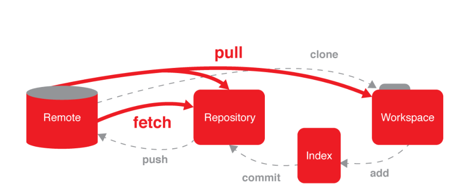
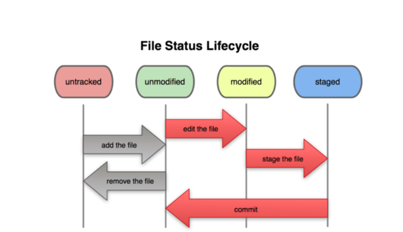

### **GIT**

**由来**

**Linux内核代码需要版本管理工具管理代码，2002年开始，使用的是BitMover公司的BitKeeper这个商用软件。但 是Linux社区崇尚的是自由软件相悖。**

**2005年，Andrew Tridgell对BitKeeper的协议进行逆向工程，BitKeeper作者决定收回无偿使用授权。磋商无果， Linus又找不到合适的版本管理工具，决定自行开发分布式版本管理工具，一个月后，Linux内核代码被Git接管。**

**2008年，基于WEB使用Git进行版本控制的软件托管服务的网站GitHub上线。**

**2016年5月9日，11年后，BitKeeper开源，发布在了GitHub上。**

**2018年6月4日，微软宣布，通过75亿美元的股票交易收购代码托管平台GitHub。**

### **安装**

[**[https://git-scm.com/downloads]{.underline}**](https://git-scm.com/downloads)

**下载对应操作系统的Git客户端版本**

**Linux**

**从RHEL上安装非常简单**

```shell
yum install git
```

**windows**

**下载对应的32位或者64版本，点击安装即可**

> **\$ git \--version 查看版本号**

**概念**

| 名称                       |                                                         |
| -------------------------- | ------------------------------------------------------- |
| Repository 仓库、版本库    | git初始化后，会在当前目录生成一个.git目录，这就是版本库 |
| Workspace 工作空间、工作区 | .git文件所在的目录就是工作区，一般是项目的根目录        |
| index索引                  | 介于工作区和版本库之间，暂存修改的                      |
| remote 远程版本库          | 网络上的另一个版本库，可以和本地库交互                  |




**使用**

**初始化一个版本库**

```shell
$ git init
Initialized empty Git repository in /home/python/magedu/projects/cmdb/.git/
```


**在当前目录中增加了一个.git目录，不要自行修改这个目录里面的文件。**

**当前目录一般是项目的根目录。**

**添加文件**

```shell
$ echo \'\<html\>\<head\>\<title\>test\</title\>\</head\>\<body\>My Website\</body\>\</html\>\' > index.htm
$ git add index.htm
```


**单个文件添加**

**这一步是把文件的当前变化增加到索引中，也就是以后这个文件需要版本库来跟踪管理，注意这不是提交。 此时，文件还可以继续修改，还可以添加新的被跟踪文件，一定要add才能把这些改变加入到索引中**

**批量添加**

> **\$ git add .**


**.点号，代表当前目录，这条命令将递归添加当前目录及其子目录所有文件 只要是目录，就会递归添加该目录下的文件和子目录。**

**查看状态**

```shell
$ git status
$ git status -s
```

> **-s, \--short 短格式输出**

**Git的文件分类**

> * 追踪的Tracked，已经加入版本库的文件
>
> * 未追踪的Untracked，未加入到版本库的未被管理的文件
>
> * 忽略的Ignored，git不再关注的文件，例如一些临时文件

**.gitignore文件中，目录以/结尾，行起始的!是取反**

**.gitignore内容如下：**
```
**\*.ipynb**

**\_\_pycache\_\_/**

**.python-version**

忽略文件不需要自己写，Python的已经有了


[https://github.com/github/gitignore/blob/master/Python.gitignore](https://github.com/github/gitignore/blob/master/Python.gitignore)

$ wget -O .gitignore https://raw.githubusercontent.com/github/gitignore/master/Python.gitignore
 ```
其它语言的在这里找 [https://github.com/github/gitignore](https://github.com/github/gitignore)

**再次看看状态**

> **\$ git status**

**提交代码**
```shell

$ git commit   --help

$ git commit -m \"First Commit\"

[master (root-commit) 8a73953\] First Commit

Committer: python \<python\@nodex.(none)\>

Your name and email address were configured automatically based

on your username and hostname. Please check that they are accurate.

You can suppress this message by setting them explicitly:
		git config \--global user.name \"Your Name\"
		git config \--global user.email you\@example.com

If the identity used for this commit is wrong, you can fix it with:
		git commit \--amend \--author=\'Your Name \<you\@example.com\>\'	

1 files changed, 1 insertions(+), 0 deletions(-)

create mode 100644 index.htm

$ git status

On branch master

nothing to commit (working directory clean)

```


**commit 提交更改到版本库**

**-m 填写本次日志消息，必须写。工作中，程序员应该对每一次提交写明做了什么改动 修改后再次提交**

> **\$ sed -i -r \'s@(\<body\>)(.\*)(\</body\>)@\\1Welcome to \\2\\3@\' index.htm**
>
> **\$ git status**
>
> **\# On branch master**
>
> **\# Changed but not updated:**

> **no changes added to commit (use \"git add\" and/or \"git commit -a\") \$ git commit -m \"Second Commit\"**
>
> **\# On branch master**
>
> **\# Changed but not updated:**

> **no changes added to commit (use \"git add\" and/or \"git commit -a\")**
>
> **看上面的信息，commit之后发现，变动的文件index.htm并没有提交。 \$ git add index.htm**
>
> **\$ git commit -m \"Second Commit\"**
>
> **\[master b22f4a1\] Second Commit**
>
> **Committer: python \<python\@nodex.(none)\>**
>
> **Your name and email address were configured automatically based**
>
> **on your username and hostname. Please check that they are accurate. You can suppress this message by setting them explicitly:**
>
> **git config \--global user.name \"Your Name\"**
>
> **git config \--global user.email you\@example.com**
>
> **If the identity used for this commit is wrong, you can fix it with: git commit \--amend \--author=\'Your Name \<you\@example.com\>\'**
>
> **1 files changed, 1 insertions(+), 1 deletions(-)**

**提交成功**

**文件的生命周期**

**文件add后，就成为可跟踪文件的未修改状态unmodified，修改后，文件就变成modified状态。再次add后，将变 化提交到索引，状态变为staged，这才能提交。提交成功，文件状态从staged变回unmodified。**

**git的提交**

**git的提交分为两个步骤：**

**暂存变更：add作用是把新文件或者文件新的改动添加到一个暂存区stage，也就是加入到index中**

**提交变更：commit提交的是暂存区中的改动，而不是物理文件目前的改动，提交到当前分支，默认是master分支 也可以使用下面命令，将两步合成一步**

> **\$ git commit index.htm**

**如果改动了一批文件，一个个写名字很麻烦，使用下面的命令**

> **\$ git commit -a**

**-a，\--all 会把所有跟踪的文件的改动自动暂存，然后commit。上面命令未提交message，会出现一个类似vi命令的 操作界面，需要编写message之后，才行。**

**也可以使用下面的命令，把message信息一并填写了。**

> **\$ git commit -a -m \"message\"**

**增补**

**第二次提交后，忘记加入一个文件about.htm**

> **\$ touch about.htm**
>
> **\$ git add about.htm**
>
> **\$ git commit \--amend**
>
> **\[master 40dcd33\] Second Commit amend**


> **Committer: python \<python\@nodex.(none)\>**
>
> **Your name and email address were configured automatically based**
>
> **on your username and hostname. Please check that they are accurate.**
>
> **You can suppress this message by setting them explicitly:**
>
> ​	**git config \--global user.name \"Your Name\"**
>
> ​	**git config \--global user.email you\@example.com**
>
> **If the identity used for this commit is wrong, you can fix it with:**
>
> ​	**git commit \--amend \--author=\'Your Name \<you\@example.com\>\'**
>
> **1 files changed, 1 insertions(+), 1 deletions(-)**
>
> **create mode 100644 about.htm**
>
> **\--amend 修改，通过创建一个新的commit来replace当前分支的顶部。**

> 也可以在命令中继续使用-m选项直接提交message。

> **git log 查看一下版本库里面提交的历史记录**

**diff比较**

**查看各种差异**

 git diff 查看被跟踪文件未暂存的修改，比较暂存区和工作区

 **git diff \--cached 查看被跟踪文件暂存的修改，比较暂存区和上一次commit的差异**

 **git diff HEAD ，查看被跟踪文件，比较工作区和上一次commit的差异。HEAD指代最后一次	commit**


```python
$ echo "welcome about" > about.htm # modified状态

$ git diff

 diff --git a/about.htm b/about.htm

 index e69de29..621ec3a 100644

 --- a/about.htm

 +++ b/about.htm

 @@ -0,0 +1 @@

 +welcome about
```

```python
$ git add about.htm
# staged状态

$ git diff

$ git diff --cached

diff --git a/about.htm b/about.htm

index e69de29..621ec3a 100644

--- a/about.htm

+++ b/about.htm

@@ -0,0 +1 @@

+welcome about

```

```p
修改about.htm为如下内容
$ cat about.htm

<html>

welcome about

</html>

$ git diff

diff --git a/about.htm b/about.htm

index 621ec3a..5a99d50 100644

--- a/about.htm

+++ b/about.htm

@@ -1 +1,3 @@

+<html>

welcome about

+</html>

$ git diff --cached

diff --git a/about.htm b/about.htm

index e69de29..621ec3a 100644

--- a/about.htm

+++ b/about.htm

@@ -0,0 +1 @@

+welcome about

$ git diff HEAD

diff --git a/about.htm b/about.htm

index e69de29..5a99d50 100644

--- a/about.htm

+++ b/about.htm

@@ -0,0 +1,3 @@

+<html>

+welcome about

+</html>
```

### **HEAD**

**HEAD可以看做是一个游标，一般是指向当前分支最后一次提交。**

**HEAD的值存储在.git/HEAD中**

**HEAD，指代最后一次commit**

**HEAD\^，指代上一次提交**

**HEAD\^\^，指代上上一次提交**

**上n次提交，表示为HEAD\~n**

### **检出和重置**

**checkout 用于切换分支，或恢复工作区文件。**

**注意，checkout会重写工作区，这个命令还是较为危险的。**

| 命令                | 说明                                                         |
| ------------------- | ------------------------------------------------------------ |
| git checkout        | 列出暂存区可以被检出的文件                                   |
| git checkout file    | 从暂存区检出文件到工作区，就是覆盖工作区文件，可指定检出的文件。但是不清 除stage |
| git checkout commit | 检出某个commit的指定文件到暂存区和工作区                     |
| git checkout .      | 检出暂存区的所有文件到工作区                                 |

```p
$ echo > about.htm # 清除工作区文件内容

$ git checkout about.htm # 从暂存区检出到工作区，工作区文件有了内容

$ git checkout HEAD about.htm # 使用当前分支的最后一次commit检出覆盖暂存区和工作区 # 下面3条命令结果一致了

$ git diff

$ git diff --cached

$ git diff HEAD
```

| 命令             | 说明                                               |
| ---------------- | -------------------------------------------------- |
| git reset        | 列出将被reset的文件                                |
| git reset file    | 重置文件的暂存区，和上一次commit一致，工作区不影响 |
| git reset --hard | 重置暂存区与工作区，与上一次commit保持一致         |

```python
$ echo "<html>Welcome about</html>" > about.htm $ git add about.htm # 添加到暂存区

$ git reset about.htm # 使用最后一次提交覆盖暂存区 $ cat about.htm # 工作区文件有内容

$ git add about.htm # 添加到暂存区

$ git reset --hard # 重置暂存区与工作区为上一次commit $ cat about.htm # 工作区文件无内容
```

| 命令                       | 说明                                                         |
| -------------------------- | ------------------------------------------------------------ |
| git reflog                  | 显示commit的信息，只要HEAD发生变化，就可以在这里看到         |
| git reset commit           | 重置当前分支的HEAD为指定commit，同时重置暂存区，但工作区不变 |
| git reset \--hard[commit\] | 重置当前分支的HEAD为指定commit，同时重置暂存区和工作区，与指定commit一致 |
| git reset \--keep[commit\] | 重置当前HEAD为指定commit，但保持暂存区和工作区不变           |

### 移动和删除

git mv src dest    改名, 直接把改名的改动放入暂存区

git rm file 会同时在版本库和工作目录中删除文件,真删除

git rm --cached file 将文件从暂存转成未暂存,从版本库中删除, 但不删除工作目录的该文件,即文件恢复成不追踪的状态

以上都算是改动, 必须commit才算是真改动了

--------------------------- ------------

**push到服务器**

**本地搭建了一个github私服，模拟GitHub**

[**[http://192.168.142.135:3000/my/test.git]{.underline}**](http://192.168.142.135:3000/my/test.git)

关联远程版本库

  git remote 列出所有远程仓库
------------------------------------------ ------------------------
  git remote -v   详细列出所有远程仓
  git remote add [shortname] [url]   指定一个名称指向远程仓库

指定推送到的远程主机和分支

指定当前分支推送到的主机和对应分支

> **\$ git push -u origin master \# 指定远程默认主机和分支**
>
> **\$ git push**

**\# simple方式，默认只推送当前分支到默认关联的远程仓库**

> **-u 第一次远程推送的时候加上，以后就可以不使用-u参数，可以git push origin master，也可以git push都使用默 认。**

> **\$ echo \"welcome about\" \> about.htm**
>
> **\$ git commit -a**
>
> **Aborting commit due to empty commit message.**
>
> **\$ git commit -a -m \"修改了about.htm\"**
>
> **\[master 6c20f48\] 修改了about.htm**
>
> **Committer: python \<python\@nodex.(none)\>**
>
> **Your name and email address were configured automatically based**
>
> **on your username and hostname. Please check that they are accurate.**
>
> **You can suppress this message by setting them explicitly:**
>
> **git config \--global user.name \"Your Name\"**
>
> **git config \--global user.email you\@example.com**
>
> **If the identity used for this commit is wrong, you can fix it with:**
>
> **git commit \--amend \--author=\'Your Name \<you\@example.com\>\'**
>
> **1 files changed, 1 insertions(+), 0 deletions(-)**
>
> **\$ git push origin master \# 或者git push**

**从远程库克隆**

这一次使用git协议连接远程库。

为了演示跨平台，这里使用windows系统。

建议使用Git的windows客户端的 git bash ，它含有常用ssh命令

配置本地用户名、邮箱

**打开gogs的用户设置 -\> SSH密钥**

**打开公钥文件\~/.ssh/id\_rsa.pub，将内容贴入"密钥内容"框中，点击"增加密钥"**

**那么SSH登录的用户使用的链接如下图**

**SSH连接远程库**

**在windows上找一个空目录，执行下面的克隆命令。**

**注意，第一次使用ssh连接有提示，敲入yes。**

> **\$ git clone git\@192.168.142.135:my/test.git**
>
> **Cloning into \'test\'\...**
>
> **remote: Counting objects: 28, done.**
>
> **remote: Compressing objects: 100% (20/20), done.**
>
> **remote: Total 28 (delta 0), reused 0 (delta 0)**
>
> **Receiving objects: 100% (28/28), done.**

**克隆成功。**

**下面就可以使用这个初始的项目文件开发了。**

**注：Linux和windows下交替演示，是想说明，git客户端无所谓在什么操作系统。 Pycharm中使用Git**

**Git私服创建cmdb项目版本库**

**获得远程仓库地址 git\@192.168.142.135:my/cmdb.git 如有必要，添加密钥，这里不再赘述。**

**从版本控制工具中获取项目，选择Git**

**选择项目目录，填入远程版本库地址，Test测试一下**

**成功，并直接用Pycharm打开项目。 项目开发**

**添加app.py文件，提示是否加入到git**

**编写源码app.py**

> **if \_\_name\_\_ == \"\_\_main\_\_\": print(\'Welcome to Magedu\')**


**第一次提交**

!

**这里可以选择提交，或提交并推送 本次选择提交**


**推送**


**成功push。 私服查看**

**存储stash**

> **命令**
>
> **git stash**
>
> **git stash pop**

**说明**

**暂时存储最后一次提交后的变化，放入栈中 从栈中取出刚才保存的变化，并合并**

**增加一个新的文件并再次提交dispatcher.py**


> **\# dispatcher.py**
>
> **class Dispatcher:**
>
> **cmds = {}**
>
> **def reg(self, cmd, fn):**
>
> **pass**
>
> **def run(self):**
>
> **pass**
>
> **commit提交一下后，开始完善分发器代码 class Dispatcher:**
>
> **cmds = {}**
>
> **def reg(self, cmd, fn):**
>
> **self.cmds\[cmd\] = fn**
>
> **def run(self):**
>
> **pass**
>
> **def defalutfn(self):**
>
> **print(\'Unknown Command\')**


**这时候发现app.py急需完善代码，但是分发器模块没有完成不想提交，这时候就需要stash了。**

> **执行完，工作区回到了上次提交的样子，回到app.py中完成修改，最后提交。 if \_\_name\_\_ == \'\_\_main\_\_\':**
>
> **print(\'Welcome to www.magedu.com\')**


**unstash pop 刚才存储的dispatcher.py文件。**


**dispatcher.py文件又变成了刚才修改过的样子，继续完成代码，提交。**

**应用场景**

**开发中，当前手中的工作没有完成，需要中断当前工作来完成其他请求，例如修复Bug。**

**已完成的工作内容提交不合适，可能还要需要大的调整，但是紧急请求又不能不做，就需要stash存储未完成的工 作（上次提交后做的修改）。**

**分支branch**

**注：以下的操作都在Pycharm中完成，其它IDE都可以实现类似的功能，Git命令操作较为麻烦，不再演示**

**多人协作一起开发，开发项目中不同的独立的功能，这些功能可能需要好几天才能完成， 又或者定制版本，往往需要一个不同的定制需求。**

**代码中至少有一个分支，就是主干分支或称主分支Master，默认都是在主分支上开发。 单分支**

**图中绿色节点表示每一次提交commit**

**项目往往是并行多人开发的，都在主分支上克隆，然后修改提交，那么主分支就会有存在大量的冲突。甚至有一些 不完善代码提交，主分支就混乱不堪，不可维护了。**

**再一个，如果一次提交后，需要发布一个版本，这个版本以后需要独立维护、开发，而主分支还需要继续发展，怎 么办？**

**引入多分支**

**分支名**

> **分支名在版本库中必须唯一**
>
> **不能以 - 开头**
>
> **可以使用/，但是不能以它结尾，被它分割的名称不能以.开头**
>
> **不能使用两个连续的..**
>
> **不能包含任何空白字符、Git的特殊符号**

**多分支**

**创建分支**

**需要指明从什么分支上创建什么名字的分支。版本控制的Log标签页**

**到目前就在master上拉出一个分支并切换到了这个新的分支dev上开发 修改app.py，之后提交**

> **from dispatcher import Dispatcher**
>
> **if \_\_name\_\_ == \"\_\_main\_\_\":**
>
> **print(\'Welcom to www.Magedu.com\')**
>
> **dis = Dispatcher()**
>
> **dis.run()**


**push到私服上看看**

**合并分支**

**dev开发告一段落，需要将功能合并入master。 切换回到master，检出master**


**开始合并，选择No Fast Forword合并**


**目前的合并，只是本地，需要push到远程库**

**当然还可以继续检出dev分支，继续开发，开发好了，合并进来 Fast Forward 合并**

**从前面操作的图中可以看到，默认No FF不勾选的，也就是默认使用FF方式合并。**


**no-ff的好处是，可以看清楚开发分支上的代码改动。**

**上面dev分支总是开发中的代码，dev测试、审查后合并到master中。 master分支都是稳定的代码，可以发布部署。**

**GitFlow工作流**

**不同公司，不同的项目规模，不同的管理水平都有着不同Git工作流方式。 最佳实践**

**使用Git一般至少2个分支：master和develop**

**master，主干，生产环境都来主干分支上拿数据部署，也可以使用钩子自动完成 develop，开发分支，开发人员都是检出这个分支开发**

**辅助分支**

**feature 分支，具体的功能开发分支，只与 develop 分支交互。**

**release 分支，发布版本**

**hotfix 分支，紧急bug修复的版本，最后需要合并到develop 和 master中。**
